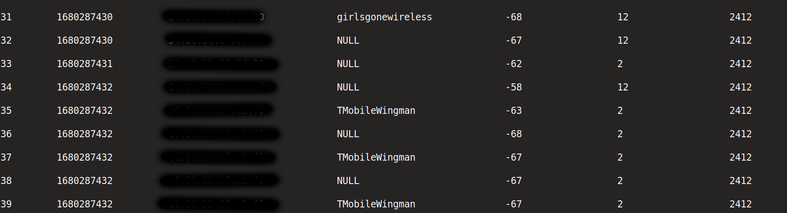

# sniff-report

Sniff Report is a command-line tool that listens for 802.11 Wi-Fi probe requests and generates a report containing the timestamp (epoch), MAC address of the device that sent the request, the SSID, signal strength (in dBm), transmission rate (in Mbps), and the channel frequency (in MHz) of the access point. The tool uses the Tins library to capture and decode Wi-Fi packets.

## Disclaimer

This tool is intended for educational purposes only, showing users the risks that come with easily identifiable SSIDs and leaving devices WiFi powered on when in not in use.

## Requirements

- Linux operating system
- C++11 or later
- Tins library (https://github.com/mfontanini/libtins)

## Installation

1. Install the Tins library by following the instructions in the [Tins documentation](https://libtins.github.io/download/).
2. Clone this repository to your local machine:\
`git clone https://github.com/rootloopz/sniff-report.git`
3. Build the tool by running the following commands in the repository directory:\
`cd sniff-report`\
`make`

## Usage

Run the setup.sh script to select and turn the selected interface into monitor mode:\
`./setup.sh`

Run the tool with sudo privileges:\
`sudo ./sniff-report <interface> <packet limit>`

- `interface`: The name of the network interface to capture packets on (e.g. `wlan0`, `eth0`). To list available interfaces, run the `ifconfig` command.
- `packet limit` (optional): The maximum number of packets to capture before stopping the tool. If not specified, the tool will run indefinitely.

The tool will output the report to the terminal in tabular format. The table columns are: count, timestamp, MAC address, SSID, signal (dBm), rate (Mbps), and channel frequency (MHz). 

To stop the tool, press `Ctrl+C`.

## Acknowledgments

Inspiration, code snippets, etc.
* [libtins C++ Socket/802.11 Library](http://libtins.github.io/)
* [heyyou SSID Sniffer](https://github.com/abzicht/heyyou)

## License

This tool is licensed under the GPL-3.0 license. See the `LICENSE` file for details.
